

  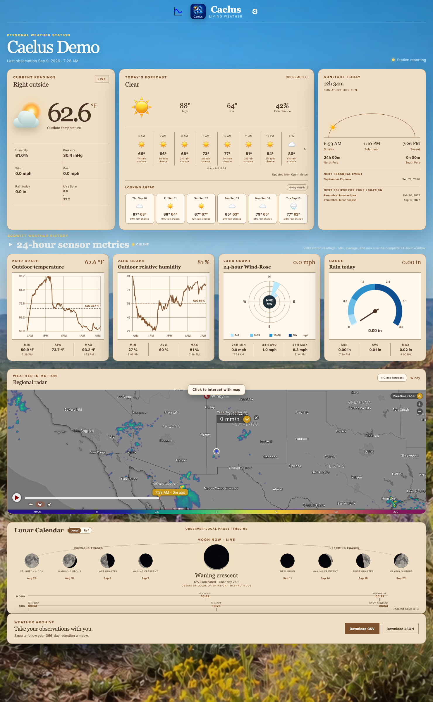

# Caelus User Guide

Caelus is a local weather dashboard and history service for an Ecowitt-compatible gateway. It combines current station readings, forecasts, 24-hour metric cards, longer-range graphs, a regional Windy radar map, and observer-local Sun and Moon information in one browser view.

This guide is for day-to-day users. You do not need to understand Python, FastAPI, or SQLite to operate Caelus.

The screenshots use a neutral demo station. Your location, readings, gateway model, forecast, lunar view, and available metrics will differ.

## Open Caelus

Start Caelus with the launcher created by the installer, then open one of these addresses:

- On the Caelus computer: `http://127.0.0.1:8767`
- From another device on the same trusted network: `http://<Caelus-computer-LAN-IP>:8767`

The usual installed launchers are `/Users/<name>/Caelus/run_caelus.sh` on macOS, `/home/<name>/Caelus/run_caelus.sh` on Linux or Raspberry Pi, and `C:\Users\<name>\Caelus\run_caelus.cmd` on Windows.

The top of the dashboard shows the station name, the time of the last stored observation, and station status. **Station reporting** means Caelus is receiving usable observations. **Gateway standing by** means no current reading is available yet.

## Quickstart Station Setup

Before configuring Caelus, use the Ecowitt app or gateway interface to:

1. Join the gateway to 2.4 GHz Wi-Fi.
2. Pair the outdoor weather array.
3. Confirm that the gateway displays live readings.
4. Give the gateway a stable LAN address, preferably with a DHCP reservation in the router.

Then configure Caelus:

1. Select **Settings**, then **Station**.
2. Enter the gateway base URL, such as `http://192.168.1.100`.
3. Select **Find Sensors**.
4. Review the reported gateway version and sensor inventory.
5. Set the retrieval interval from 60 to 3600 seconds.
6. Select **Save Gateway**.

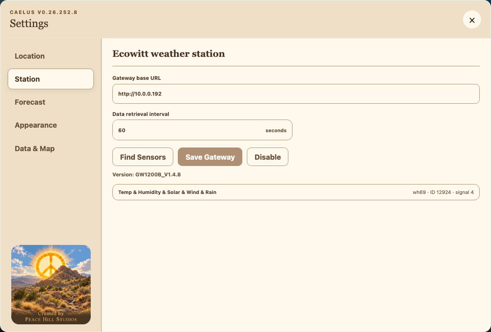

Caelus uses read-only Ecowitt LAN endpoints. It does not configure Ecowitt cloud upload, custom-server push, MQTT, Nodus sensors, or switches. **Disable** stops future gateway polling without deleting stored history.

## Settings

Select **Settings** to open the control room. Each pane saves independently. A save in one pane does not submit unsaved edits from another pane.

The dialog supports mouse, touch, and keyboard navigation. Closing without saving restores an unsaved theme preview.

### Station

- **Gateway base URL** must be an absolute `http://` or `https://` address without embedded credentials or a fragment.
- **Data retrieval interval** accepts 60 to 3600 seconds.
- **Find Sensors** queries the gateway and displays its model and paired inventory.
- **Save Gateway** saves a successful discovery and enables polling.
- **Disable** stops polling while preserving the database and saved history.

Both scheduled and manual polls use the same normalization and persistence workflow. A failed fetch does not erase the last stored observation.

### Location

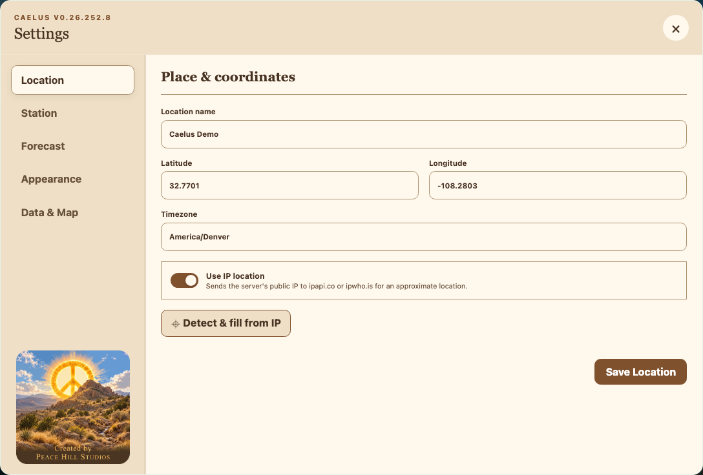

- **Location name** is the dashboard heading.
- **Latitude** accepts -90 through 90.
- **Longitude** accepts -180 through 180.
- **Timezone** uses an IANA name such as `America/Denver`.
- **Use IP location** allows automatic detection.
- **Detect & fill from IP** performs detection immediately and fills the location fields.

For manual setup, clear **Use IP location**, enter coordinates and a matching timezone, then select **Save Location**.

When IP location is enabled or explicitly detected, Caelus sends the server’s public IP address to `ipapi.co`, with `ipwho.is` as a fallback, to obtain an approximate city, timezone, latitude, and longitude. Astral then performs Sun and Moon calculations locally from the saved coordinates; Astral is not the IP-location provider.

### Forecast

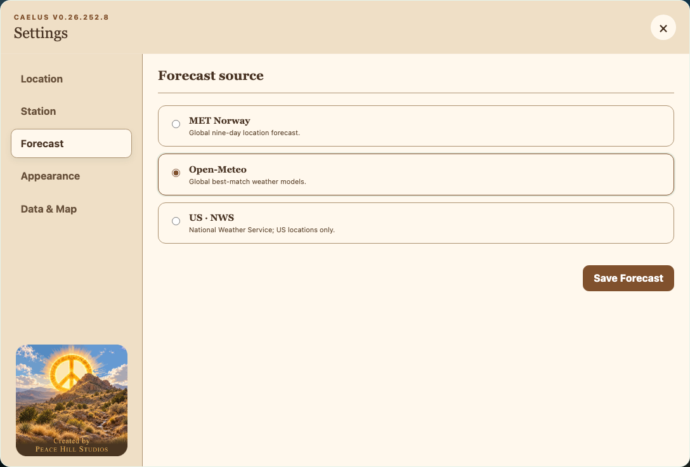

Choose one provider, then select **Save Forecast**:

- **MET Norway**: global location forecast.
- **Open-Meteo**: global best-match weather models.
- **US · NWS**: National Weather Service data for US locations only.

Forecast requests send the saved latitude and longitude to the selected provider. All provider responses are normalized into the same dashboard layout.

### Appearance

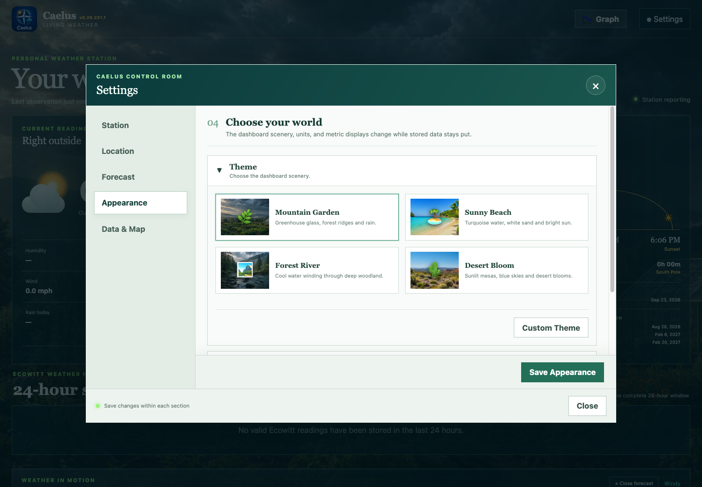

The appearance pane contains three expandable sections:

- **Theme**: Mountain Garden, Sunny Beach, Forest River, Desert Bloom, or a custom image theme. Selecting any theme previews it immediately; **Save Appearance** makes it persistent.
- **Units**: Imperial (`°F`, mph, inHg, inches) or Metric (`°C`, km/h, hPa, millimetres).
- **Display Style**: set all metric cards to one initial style, then adjust individual exceptions.

Changing units, scenery, or card style does not modify the underlying weather history.

#### Create a Custom Theme

Select **Custom Theme** at the bottom of the expanded Theme section to open the creator.

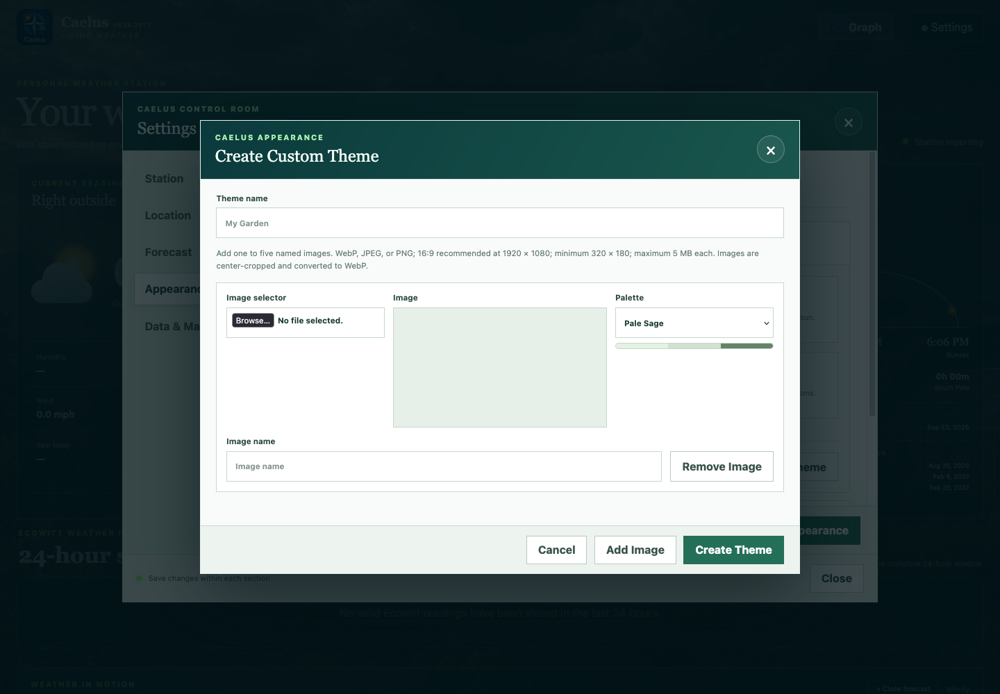

1. Enter a collection name, such as **My Garden**.
2. Choose an image, give it a display name, and select a palette. The palette controls the preview accents and is limited to Caelus's tested, readable choices.
3. Select **Add Image** to add more image choices to the same collection. A collection can contain one to five images, and each image can use a different palette.
4. Select **Create Theme**. Caelus validates and processes every image, then adds the collection to **Appearance > Theme**.
5. Select one of the new image cards and choose **Save Appearance** to make it the active dashboard theme.

Custom Theme image requirements:

- WebP, JPEG, or PNG format.
- Static images only; animated images are rejected.
- At least 320 x 180 pixels and no more than 20 million pixels.
- No more than 5 MB per image.
- A 16:9 image at 1920 x 1080 is recommended. Other aspect ratios are center-cropped.
- Theme and image names are required and may contain up to 60 characters.
- Every image must use one of the eight supplied palettes: Pale Sage, Pale Earth, Pale Water, Pale Sky, Pale Blossom, Pale Fruit, Warm Neutral, or Cool Neutral.

Caelus converts accepted images to 1920 x 1080 WebP files and creates 480 x 270 WebP thumbnails. On a standard installation, the manifest is stored at `/Users/<name>/Caelus/data/theme_settings/themes.json` on macOS, `/home/<name>/Caelus/data/theme_settings/themes.json` on Linux or Raspberry Pi, or `C:\Users\<name>\Caelus\data\theme_settings\themes.json` on Windows. Processed images are stored beside it under the absolute `data/theme_assets` path for that installation. Back up the entire installed `data` directory to preserve custom themes with settings and history.

Select **Delete** beside a collection to remove that collection and its generated images. If the deleted collection is active, Caelus immediately falls back to Mountain Garden and saves that fallback. Deletion cannot be undone except by restoring a backup or recreating the theme.

### Data & Map

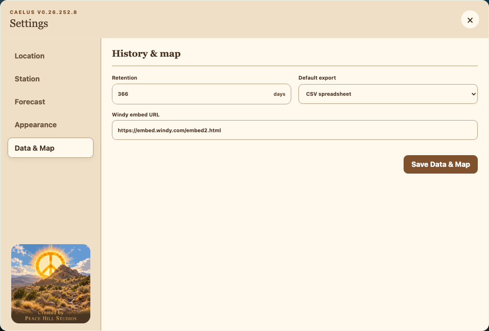

- **Retention** accepts 30 to 366 elapsed days. Successful gateway polls prune readings older than this window.
- **Default export** selects CSV or JSON as the stored preference.
- **Windy embed URL** must remain the supported secure endpoint: `https://embed.windy.com/embed2.html`. Caelus adds the saved station coordinates and marker when it builds the displayed URL.

Select **Save Data & Map** to apply the pane.

## Dashboard Overview

### Current Readings

The **Current readings** card shows the latest outdoor temperature and a compact summary of outdoor humidity, relative pressure, wind, gust, rain today, UV, and solar radiation. A dash means the gateway did not supply a usable value for that field.

Values are displayed in the unit system selected under **Settings > Appearance > Units**. Changing units changes presentation only; stored readings are not rewritten.

### Today’s Forecast

The forecast card shows today’s condition, high and low temperature, precipitation chance, up to 24 hourly samples, and six future daily summaries. Use the arrow at the right of the hourly row to page through later hours.

Select **6-day details** for daily temperature ranges, relative-humidity ranges, wind descriptions and speeds, precipitation chances, and early/late sky summaries.

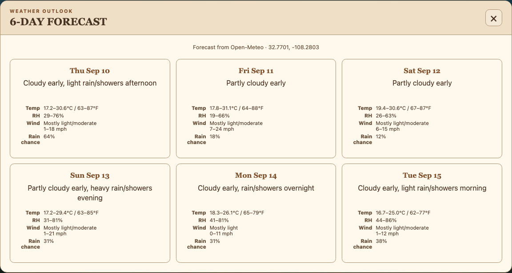

The provider label identifies the active forecast source. When a provider is temporarily unavailable, Caelus preserves and labels the last good cached forecast rather than replacing it with an empty result.

### Sunlight and Seasonal Information

The **Sunlight today** card uses the saved coordinates and timezone. Sunrise, solar noon, sunset, daylight duration, and the daylight track come from the same local-date calculation. It also shows daylight at the North and South Poles, the next seasonal event, and locally visible eclipse information when the astronomy data package is available.

If eclipse calculations are unavailable, rerun the Caelus installer so the packaged astronomy data is installed in the Caelus runtime.

### 24-Hour Sensor Metrics

The **24-hour sensor metrics** section shows every metric that has valid stored data. The first four cards are visible initially. Select the triangle beside the section title to reveal or hide the remaining metrics.

Each card includes the current value and the minimum, average, and maximum calculated from the complete 24-hour window. Minimum and maximum timestamps use the configured local timezone.

A card can display:

- **24Hr Graph**: stored readings for the last 24 hours.
- **6Hr Graph**: stored readings for the last six hours.
- **Gauge**: the current value on that metric’s display scale.

Select a metric card to cycle its current view. To make the starting style persistent, use **Settings > Appearance > Display Style**.

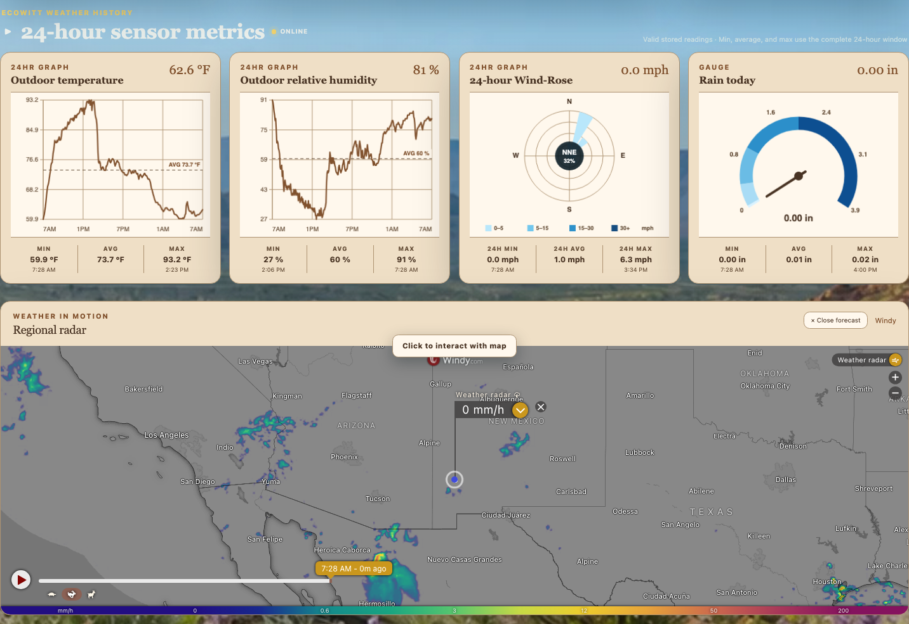

### Regional Radar

The Windy map is centered on the saved station coordinates and starts with its interaction guard enabled so normal page scrolling is not captured accidentally.

1. Select **Click to interact with map** before panning, zooming, or opening a Windy forecast.
2. Move the pointer away from the map or press Escape to restore the scroll guard.
3. Select **Close forecast** above the map to close an open Windy forecast panel and return to the station-centered radar view.

Windy is a separate cross-origin service. Caelus cannot directly operate the controls inside its forecast panel.

### Moon Phase and Weather Archive

The lunar header shows four phases before and four phases after the live Moon. The center disk is calculated for the saved observer location: illumination, lunar age, altitude, bright-limb direction, and lunar-surface rotation reflect the local sky instead of a fixed phase icon.

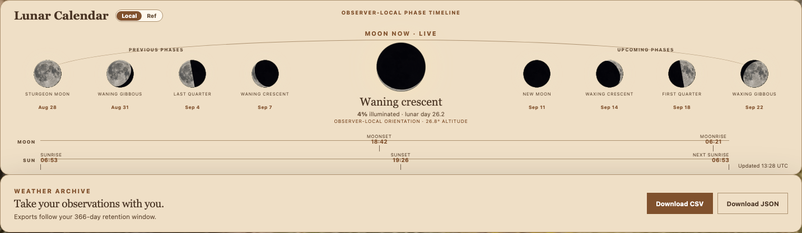

Use **Download CSV** or **Download JSON** to export observations inside the configured retention window. CSV is intended for spreadsheets; JSON preserves a machine-readable object structure. Browser downloads use the button selected, even if the default export setting differs.

## Caelus Graphum

Select **Graph** in the dashboard header to open the full-screen history graph.

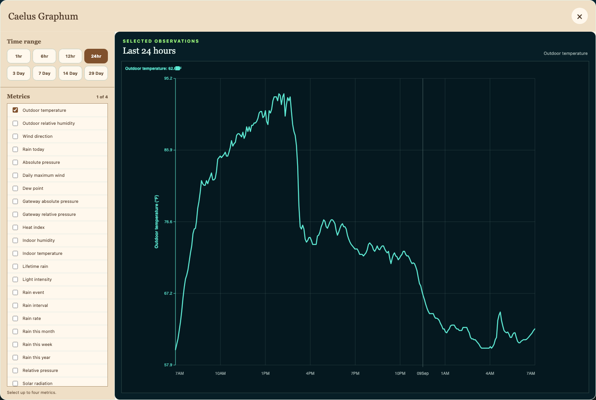

Choose a time window of 1, 6, 12, or 24 hours, or 3, 7, 14, or 29 days. Select up to four metrics. Caelus gives each selected measurement an independently labeled scale so values with different units can be compared over the same time period.

The available list contains only metric types Caelus knows how to normalize; a selected metric can still have gaps when the gateway did not report it. Close the graph with the **X** button or Escape.

## Routine Operation

- Leave Caelus running on the host computer so scheduled polling and retention continue.
- Give the gateway and Caelus computer stable LAN addresses when possible.
- Check the station-status label and last-observation time before relying on a reading.
- Treat forecast data as guidance; it is supplied by the selected external provider, not by the Ecowitt gateway.
- Back up the installed `data` directory if the local history matters. Typical paths are `/Users/<name>/Caelus/data` on macOS, `/home/<name>/Caelus/data` on Linux or Raspberry Pi, and `C:\Users\<name>\Caelus\data` on Windows.

## Troubleshooting

### The Dashboard Does Not Open

Confirm that the Caelus launcher is still running and open `http://127.0.0.1:8767` on the host. From another device, use the Caelus computer’s LAN address and confirm that both devices are on the same trusted network. A host firewall may need to allow inbound TCP port 8767.

If Caelus was installed elsewhere, use the absolute launcher path for that installation rather than a relative command.

### The Station Is Standing By or the Observation Is Old

1. Confirm that the Ecowitt gateway is powered and shows sensor data in its own interface.
2. Confirm that the gateway and Caelus computer are on the same LAN.
3. Open **Settings > Station** and verify the gateway’s current base URL.
4. Select **Find Sensors** and review the reported model and inventory.
5. Select **Save Gateway** after a successful discovery.

If the gateway received a new DHCP address, update the URL and create a DHCP reservation to prevent another change.

### Forecast, Sun, Moon, or Map Information Is Wrong

Open **Settings > Location** and verify the latitude, longitude, and timezone together. Then verify that the chosen forecast provider supports the location. The US National Weather Service option is limited to US coordinates.

### A Metric Is Missing

Caelus displays a metric only after the gateway supplies a valid value and Caelus stores it. Expand the metric section, confirm the sensor reports that measurement in the Ecowitt interface, and allow at least one successful poll. Malformed or unavailable gateway fields are skipped without stopping the poller.

### Health Check

Open `http://127.0.0.1:8767/healthz` on the Caelus computer. A healthy running poller returns HTTP 200 with `{"status":"ok"}`. A stopped, failed, or cancelled poller returns HTTP 503 with a diagnostic detail.

## Privacy and Network Safety

Caelus is intended for a trusted private LAN and does not provide its own login screen. Do not expose port 8767 directly to the public internet.

External requests can disclose:

- The server’s public IP address to the location provider when IP location is used.
- Saved latitude and longitude to the selected forecast provider.
- Saved latitude and longitude to the embedded Windy map.

Use manual coordinates and disable IP location if you do not want to use public IP-geolocation services.
